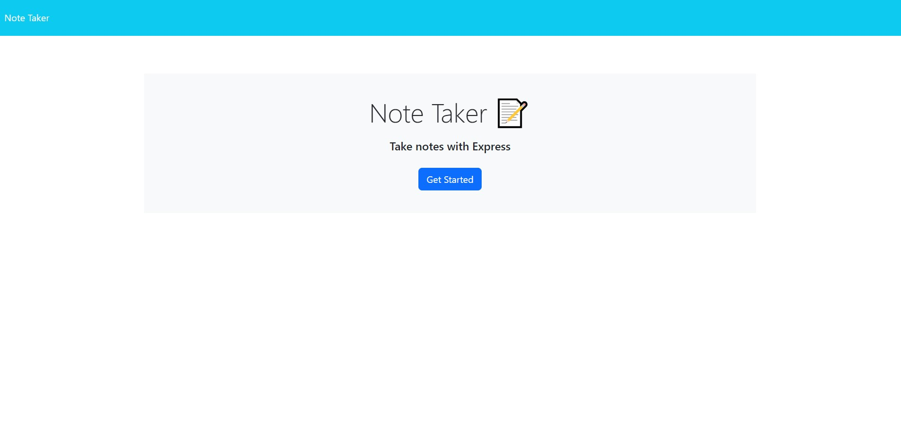

# Note-Taker

## Description

The Note Taker is a helpful tool to have in the sidebar to jot down quick thoughts about whatever you made need to do, or reminders of something to touch back on later.
As someone who has trouble remembering everything I have to do, this app is helpful for reminding me of tasks I need to complete. 
The project helped me learn more about servers and APIs and building one on my own taught me a lot about how websites work in general and how much work goes into creating even simple ones.

## Table of Contents

N/A

## Installation

N/A

## Usage

[Link to deployed application](https://afternoon-journey-99878-d3606bbe938b.herokuapp.com/)

## Credits

Class material, help from TA Neil Dhand, and documentation from nodejs.org and npmjs.com
